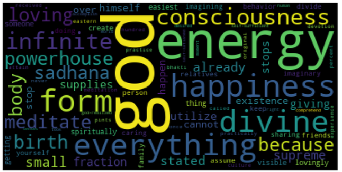

# WORDCLOUD

WordCloud generator and tag cloud generator in Python

**Language Used** : Python3

**Libraries Used** : See *requirements.txt*

**Text file used** : See *myarticle.txt* (Excerpt from the article on Purpose of Life)(https://medium.com/@subarna.lamsal1/demystifying-who-are-we-what-is-our-purpose-2df725d4352f)

**Features**

* 15*15 height*width (jpg image of WordCloud from the given text.. Can be varied)

* Word tokenization and ability to remove uninteresting words

* Works well in Jupyter

**Further to-do list** :

- [ ] Generate different shapes of wordcloud image (At present, only rectangle/ square is done.) 

- [ ] PersonCloud ( Just like how the word cloud is generated from words, I want to create cloud of images of   
characters,persons, animals...)

- [ ] Add more uninteresting words in the list ( that often occur in the sentence)

  
  ### The boxes will be ticked upon completion.
  
  #### Everyone is welcome to contribute on this work.
  
  ##### Thanks... Happy Coding.
